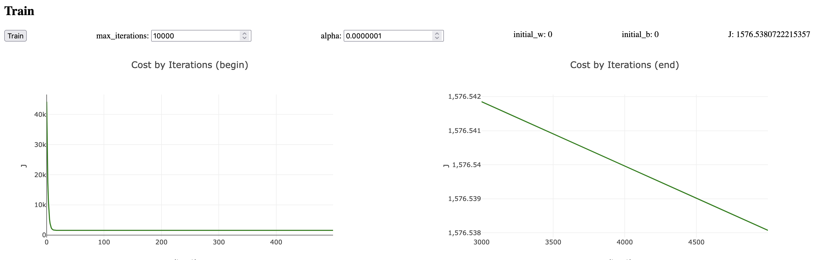
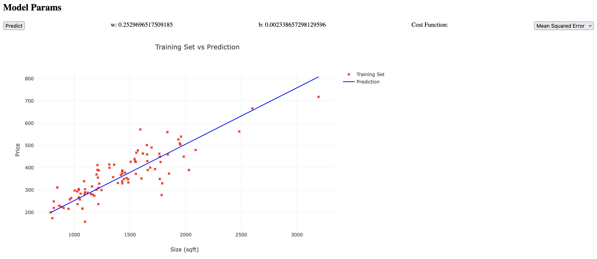
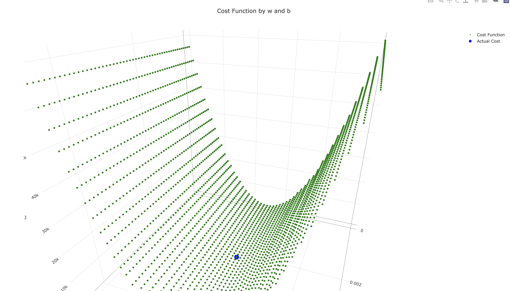
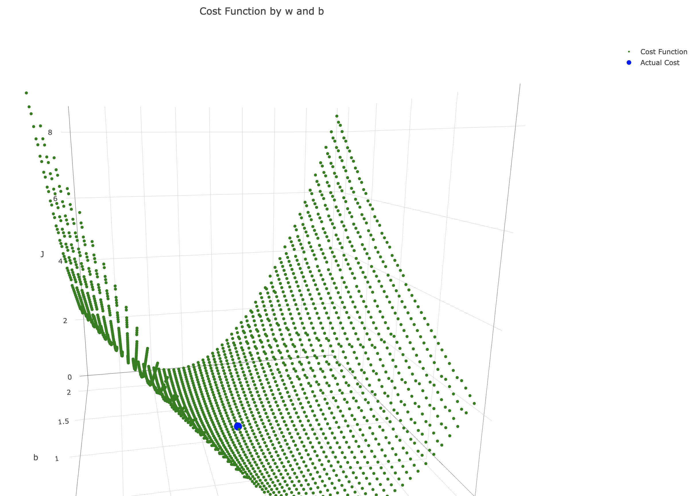
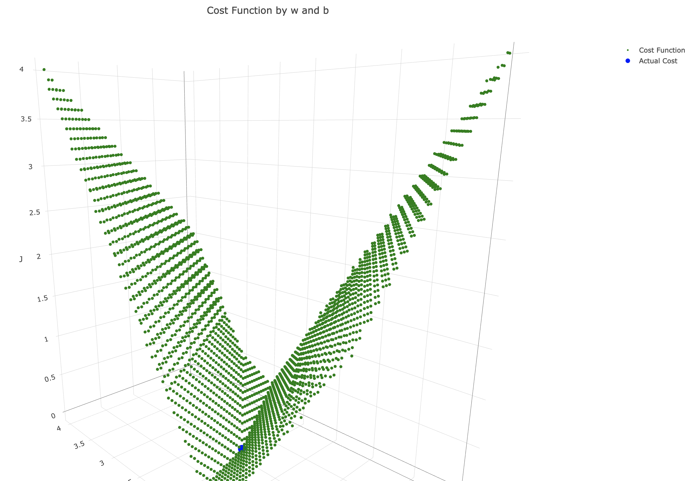
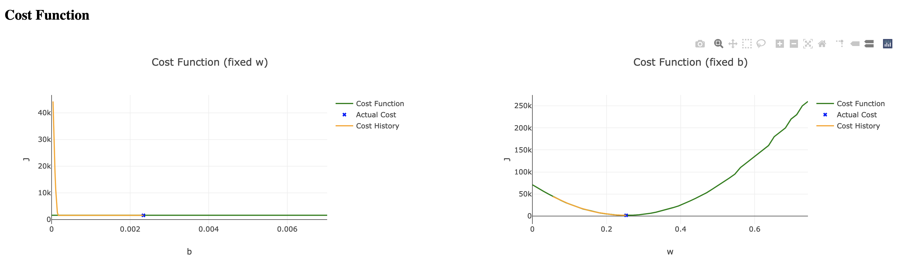
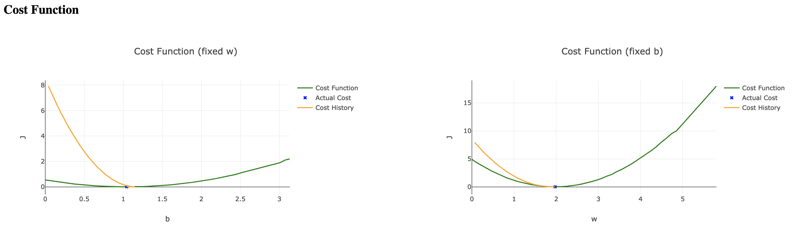
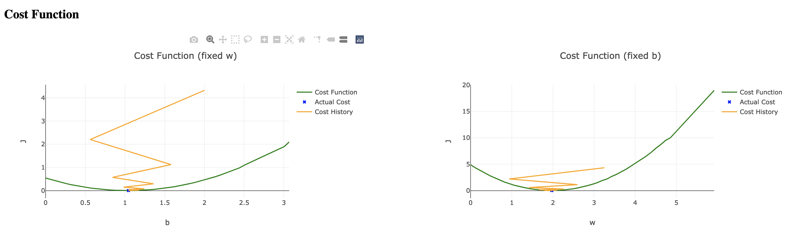

# machine-learning

Pure TypeScript/JavaScript implementation of Univariate Linear Regression, Multiple Linear Regression, and Logistic Regression.

Pure math, no libraries, no frameworks.

The application demonstrates the algorithms using a simple web interface.

Structurally, the application consists of two parts:
- REST API server.
- Client pure JS applications, one per each algorithm.

## Setup

```bash
npm i
```

```bash
npm run dev
```

API will be available on http://localhost:3000.

Run Univariate Linear Regression application:
```
open client/linear_regression/univariate/index.html
```

Run Multiple Linear Regression application:
```
open client/linear_regression/multiple/index.html
```

## Look and Feel

Training controls for Univariate Linear Regression:


Predict controls for Univariate Linear Regression:


Cost function for Univariate Linear Regression (by two parameters):




Cost function for Multiple Linear Regression (by one parameter):




## To Do
- [ ] Add /predict endpoint for the univariate linear regression
- [ ] Rewrite univariate linear regression to avoid HOF
- [ ] Cover with unit tests
- [ ] Move training set to JSON
- [ ] Make training set config using UI
- [ ] Move Cost accuracy to config
- [ ] Review the code and simplify where possible

